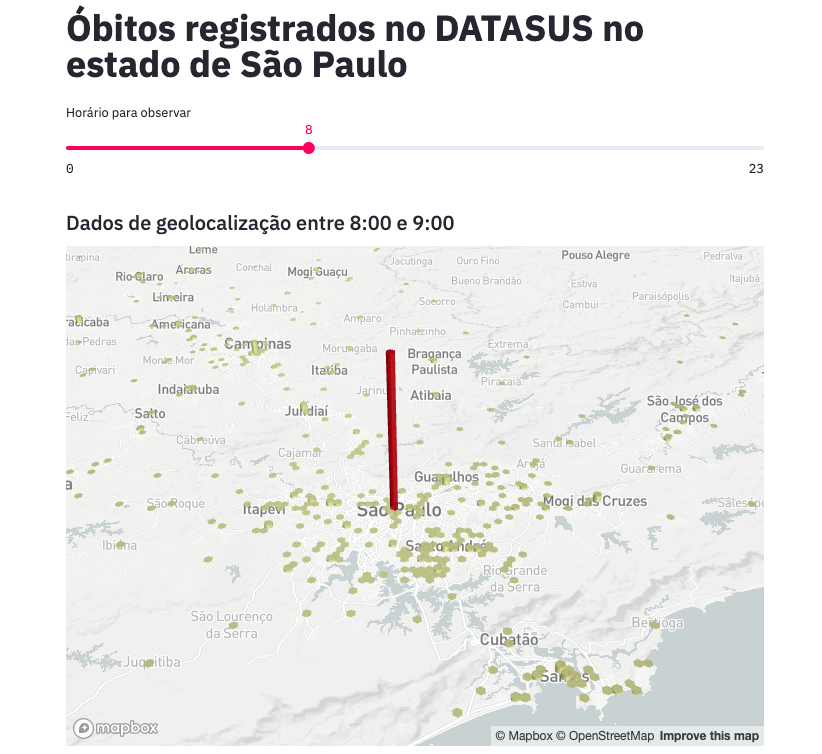
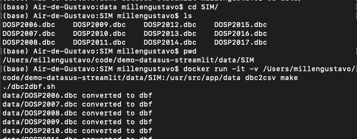
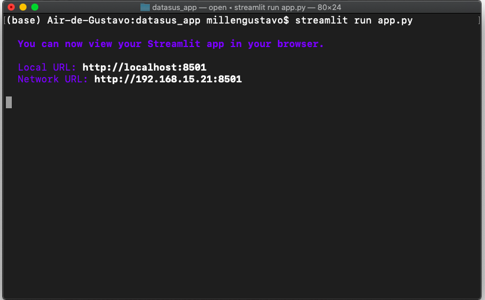

# Demo Application with DataSUS death records and Streamlit



In Brazil, [more than 70% of the population depends only on the medical assistance provided by the government](http://bvsms.saude.gov.br/bvs/pacsaude/diretrizes.php). The Brazilian public healthcare system is called SUS (Sistema Único de Saúde). 

There is a public SUS data repository available online (DataSUS). Although the data is not always clean and complete, we can derive many insights from DataSUS. 

In this post we are going to build and deploy a Streamlit application inspired on the [Uber pickups example](https://github.com/streamlit/demo-uber-nyc-pickups), but using DataSUS death records (2006-2017) and geographic coordinates from health facilities.

## Downloading the data from DataSUS

### SIM

From the [DataSUS website](http://www2.datasus.gov.br/DATASUS/index.php?area=060701) we have the definition of SIM:
> The Mortality Information System (SIM) was created by DATASUS for the regular collection of mortality data in the country. From the creation of the SIM it was possible to comprehensively capture mortality data to subsidize the various management spheres in public health. Based on this information it is possible to perform situation analysis, planning and evaluation of actions and programs in the area.

Let's download the SIM data for the São Paulo state. The prefixes of the files are "DOSP". 

#### Downloading the data from the ftp
```python
from ftplib import FTP

ftp = FTP("ftp.datasus.gov.br")
ftp.login()
ftp.cwd("dissemin/publicos/SIM/CID10/DORES/")
all_files = ftp.nlst(".")
state_prefix = "DOSP"
# We sort the list and keep only the last 12 records
# This is because they share the same layout of the current data (2006-2017)
files = sorted([file for file in all_files if state_prefix in file])[-12:]

for file in files:
    print("Downloading {}...".format(file))
    with open(file, "wb") as fp:
        ftp.retrbinary("RETR {}".format(file), fp.write)
```

#### Renaming the files which the extension is capitalized

```python
import os

files = [file for file in os.listdir() if "DOSP" in file and ".DBC" in file]

for file in files:
    os.rename(file, file[:-4] + ".dbc")
```

#### Converting from .dbc to .csv
As you may have noticed, the files are in a `.dbc` format. This is a proprietary format of the SUS Department of Informatics (DATASUS).

A kind developer provided a [tool](https://github.com/greatjapa/dbc2csv) to convert files from `.dbc` to `.csv`. To use this tool we will need to have `git` and `docker` installed.

##### Build the docker image
```bash
git clone https://github.com/greatjapa/dbc2csv.git
cd dbc2csv
docker build -t dbc2csv .
```

##### Convert the files
1. Navigate to the folder where you download the `.dbc` files. Copy the full path to the directory, you can get this path by running:
```bash
pwd
```
2. Run:
```bash
docker run -it -v <full_path_to_the_directory>:/usr/src/app/data dbc2csv make
```
3. A `/csv` folder will be populated with the converted files.



### CNES
From their [website](http://cnes.datasus.gov.br/):
> The National Register of Health Facilities (CNES) is a public document and official information system for registering information about all health facilities in the country, regardless of their legal nature or integration with the Unified Health System (SUS).

The process to download the data is simpler this time, they are already in a `.zip` file you can download from this link:

ftp://ftp.datasus.gov.br/cnes/BASE_DE_DADOS_CNES_201910.ZIP

We are going to use only one `.csv` file from this data: `tbEstabelecimento201910.csv`

## Processing the data

### Reading the facilities table with pandas

To be efficient, we will pass only the columns that matter to our application.

```python
import pandas as pd

cnes = pd.read_csv(
    "tbEstabelecimento201910.csv",
    sep=";",
    usecols=[
        "CO_CNES",
        "CO_CEP",
        "NO_FANTASIA",
        "NO_LOGRADOURO",
        "CO_ESTADO_GESTOR",
        "NU_LATITUDE",
        "NU_LONGITUDE",
    ],
)
```

### Filtering the data for the São Paulo state. 
From the dictionary available on the DataSUS website we know that '35' is the code for São Paulo. For this application we are only going to keep this data

```python
cnes = cnes[cnes["CO_ESTADO_GESTOR"]==35]
```

### Merging with the death records
My converted `.csv` SIM files are in the path `../data/SIM/csv/`, make sure you modify the path accordingly

```python
files = sorted(os.listdir("../data/SIM/csv/"))

dfs = [
    pd.read_csv(
        "../data/SIM/csv/" + file,
        usecols=["NUMERODO", "DTOBITO", "HORAOBITO", "CODESTAB"],
    )
    for file in files
]
df = pd.concat(dfs)

# We will drop the null CODESTABs (data without CNES code)
df = df.dropna()
```

Before proceeding to fill the missing coordinates, join the CODESTAB with the CO_CNES, so we have fewer facilities to fill.

```python
cnes = cnes.rename(columns={"CO_CNES": "CODESTAB"})
merged = df.merge(cnes, on="CODESTAB")

# Since we merged with the death records file, we have many duplicates, 
# let's drop it to see which facilities have coordinates missing
unique_merged = merged[
    ["CODESTAB", "CO_CEP", "NU_LATITUDE", "NU_LONGITUDE"]
].drop_duplicates()
# Filtering the data for only the records where the coordinates are missing
missing_coords = unique_merged[unique_merged["NU_LATITUDE"].isnull()]
# The CEP was automatically converted to int and we have lost the first zero digit.
# This line converts to string and pad with zero so we have a valid CEP
missing_coords["CO_CEP"] = (
    missing_coords["CO_CEP"].astype(str).apply(lambda x: x.zfill(8))
```

We have 697 CEPs without coordinates, let's try to fill them up.

## Enriching the data from DataSUS with latitude and longitude (cep_to_coords)

The data we downloaded from DataSUS is not complete. Geographic coordinates of various health facilities are missing. While latitude and longitude are not present in all cases, we do have the Brazilian zip code (CEP) for some. 

A quick search on Google for converting from CEP to latitude and longitude has shown that we had some scripts that mixed R and Python to achieve this task. 

Investigating the scripts further, it became clear that it was simple and valuable to implement this in Python. So, I removed the dependency of R to achieve the same result with just Python (https://github.com/millengustavo/cep_to_coords). 

### Install geocode from source
```bash
git clone https://github.com/millengustavo/cep_to_coords.git
cd cep_to_coords
git checkout master
pip install -e .
```

The package usage is simple. Call the `cep_to_coords` function with a valid CEP string, it will search the correios API for an address, concatenate it with the city and country and hit an [API](http://photon.komoot.de/) to get the coordinates.

If you find it useful, please leave a star on [Github](https://github.com/millengustavo/cep_to_coords). The project is still in its infancy, so it is a great opportunity to [contribute to your first open source project](https://medium.com/@austintackaberry/why-you-should-contribute-to-open-source-software-right-now-bec8bd83cfc0) adding features or refactoring the code!

### Fill the coordinates
```python
from cep_to_coords.geocode import cep_to_coords

cep_column = "CO_CEP"

unique_ceps = missing_coords[cep_column].unique()
# cep_to_coords returns a [lat, lon] list if it finds the coordinates
# else it returns [NaN, NaN]
missing_coords["lat"] = float("nan")
missing_coords["lon"] = float("nan")
for ind, elem in enumerate(unique_ceps):
    try:
        coords = cep_to_coords(elem)
        missing_coords.loc[ind, "lat"] = coords[0]
        missing_coords.loc[ind, "lon"] = coords[1]
    except Exception as e:
        print(elem, coords, e)
    print("{}%...".format(ind * 100 / len(unique_ceps)))
```

> Using the cep_to_coords function we were able to fill **78%** of the missing coordinates!

### Compiling the final CEP table

To complete the data preparation, we need to take our filled coordinates and replace the NaNs on the death records table.

```python
unique_merged["CO_CEP"] = (
    unique_merged["CO_CEP"].astype(str).apply(lambda x: x.zfill(8))
)
# unfortunately we didn't fill all coordinates, let's drop them
missing_coords = missing_coords.drop(columns=["NU_LATITUDE", "NU_LONGITUDE"]).dropna()
# joining the datasets
full_table = unique_merged.merge(missing_coords, on="CO_CEP", how="left")
# filling the missing data
full_table["lat"] = full_table.apply(
    lambda x: x["lat"] if pd.isnull(x["NU_LATITUDE"]) else x["NU_LATITUDE"], axis=1
)
full_table["lon"] = full_table.apply(
    lambda x: x["lon"] if pd.isnull(x["NU_LONGITUDE"]) else x["NU_LONGITUDE"], axis=1
)
# compiling the CEP final table
full_table = (
    full_table.drop(columns=["NU_LATITUDE", "NU_LONGITUDE", "CODESTAB_y"])
    .dropna()
    .rename(columns={"CODESTAB_x": "CODESTAB"})
    .reset_index(drop=True)
)
```

### Merging the facilities back to the death records dataframe and cleaning the data

```python
df_enriched = df.merge(full_table, on="CODESTAB")
df_enriched["HORAOBITO"] = pd.to_numeric(
    df_enriched["HORAOBITO"], downcast="integer", errors="coerce"
)
df_enriched = df_enriched.dropna()
df_enriched["DTOBITO"] = df_enriched["DTOBITO"].astype(str).apply(lambda x: x.zfill(8))
df_enriched["HORAOBITO"] = (
    df_enriched["HORAOBITO"].astype(int).astype(str).apply(lambda x: x.zfill(4))
)
# Creating a timestamp column with both date and hour of death
df_enriched["DATA"] = df_enriched["DTOBITO"] + " " + df_enriched["HORAOBITO"]
df_enriched["DATA"] = pd.to_datetime(
    df_enriched["DATA"], format="%d%m%Y %H%M", errors="coerce"
)
df_enriched = df_enriched.dropna()

df_enriched["NUMERODO"] = df_enriched["NUMERODO"].astype(str)

df_enriched["lat"] = (
    df_enriched["lat"].astype(str).str.replace(",", ".", regex=False).astype(float)
)

df_enriched["lon"] = (
    df_enriched["lon"].astype(str).str.replace(",", ".", regex=False).astype(float)
)
```

### Saving to a .parquet file

```python
df_enriched.to_parquet("dataset.parquet.gzip", compression="gzip", index=False)
```

## Creating the app using the Uber pickups example

Streamlit according to the website is 
> “The fastest way to build custom ML tools”. 

It is indeed a bold statement, but what sold me on it was the sentence on the subtitle:
> “So you can stop spending time on frontend development and get back to what you do best.”.

For this experiment, we are going to spend even less time on frontend development by using an example gently posted by the Streamlit team (https://github.com/streamlit/demo-uber-nyc-pickups). The demo presents the Uber pickups on New York City by hour. Our goal here is to replace pickups with deaths registered on SIM and New York City with the state of São Paulo. 

There are only a few things we need to change in the code to adapt the application to our use. 

### Clone the repository
```bash
git clone https://github.com/streamlit/demo-uber-nyc-pickups.git
cd demo-uber-nyc-pickups
```

### Open app.py on your favorite text editor and change the following lines (commented here)

```python
# OLD -> DATE_TIME = "date/time"
# NEW -> DATE_TIME = "data"

# OLD -> data = pd.read_csv(DATA_URL, nrows=nrows)
# NEW -> data = pd.read_parquet("../data/clean/dataset.parquet.gzip")
```

For cosmetic purposes you may also change the title and other specific references

### Install streamlit
```bash
pip install streamlit
```

### Run the app
```bash
streamlit run app.py
```



Voilà! This command will automatically open the app on your browser (port 8051 by default).

# Conclusion
This is a very simple project that shows some amazing libraries that are being developed lately for Machine Learning applications. Although we didn't used any complex techniques here, we covered an interesting part of what a data scientist do. Data ingestion, cleaning, enriching and finally visualization.

I hope you learned something from this and I encourage you to play around with Streamlit, it's definitely amazing!

